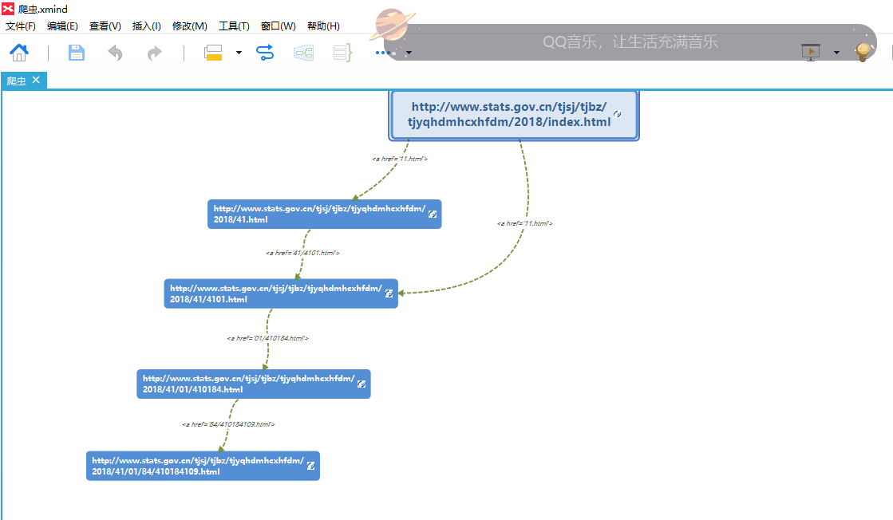

最近忙着打CTF比赛，好久没学爬虫了。。。赶紧恶补一下，学学scrypy框架，以及实现深度优先爬取内容

## 目录
- [Scrapy](#scrapy)
	- [基本安装](#基本安装) 
	- [Shell调试工具](#Shell调试工具)
	- [开发过程](#开发过程)
- [爬虫任务](#爬虫任务)
	- [任务描述](#任务描述)
	- [爬取方式](#爬取方式)

---

环境：python3.6.2，windows10

### Scrapy
#### 基本安装
安装：

	pip install scrapy

创建一个Scrapy项目：

	scrapy startproject Spider_test

之后，找到这个项目文件夹，可以看到项目文件结构：

	Spider_test
	  │  scrapy.cfg
	  │
	  └──Spider_test
	      │  item.py
	      │  middlewares.py
	      │  pipelines.py
	      │  setting.py
	      │
	      ├─ spiders
	      │    │  __init__.py
	      │    │
	      │    └─ __pycache__
	      └─ __pycache__


这些目录和文件的作用：

- scrapy.cfg：项目的总配置文件，通常无须修改。
- Spider_test：项目的 Python 模块，程序将从此处导入 Python 代码。
	- Spider_test/items.py：用于定义项目用到的 Item 类。Item 类就是一个 DTO（数据传输对象），通常就是定义 N 个属性，该类需要由开发者来定义。
	- Spider_test/pipelines.py：项目的管道文件，它负责处理爬取到的信息。该文件需要由开发者编写。
	- Spider_test/settings.py：项目的配置文件，在该文件中进行项目相关配置。
	- Spider_test/spiders：在该目录下存放项目所需的蜘蛛，蜘蛛负责抓取项目感兴趣的信息。

使用 Scrapy 开发网络爬虫主要就是开发两个组件，蜘蛛和 Pipeline。


#### Shell调试工具
打开cmd，输入：

    scrapy shell http://www.stats.gov.cn/tjsj/tjbz/tjyqhdmhcxhfdm/2018/41.html

即可看到爬取的返回信息：


#### 开发过程
##### 0x01.定义Item类；该类用于定义需要爬取的属性
如：

``` python
import scrapy


class SpiderStatisticsItem(scrapy.Item):
    # define the fields for your item here like:
    # name = scrapy.Field()

    #城市
    city = scrapy.Field()

```

##### 0x02.创建并编写Spider类

切换到项目目录，执行：

	scrapy genspider job_position "http://www.stats.gov.cn/tjsj/tjbz/tjyqhdmhcxhfdm/2018/index.html"

即可在spiders目录下找到job_position.py这个文件，打开后内容如下：

``` python
# -*- coding: utf-8 -*-
import scrapy


class JobPositionSpider(scrapy.Spider):
    name = 'job_position'
    allowed_domains = ['http://www.stats.gov.cn/tjsj/tjbz/tjyqhdmhcxhfdm/2018/index.html']
    start_urls = ['http://http://www.stats.gov.cn/tjsj/tjbz/tjyqhdmhcxhfdm/2018/index.html/']

    def parse(self, response):
        pass

```    

此类中：

- name 属性用于指定该 Spider 的名字
- allow_domains 用于限制该 Spider 所爬取的域名
- start_urls 指定该 Spider 会自动爬取的页面 URL。

##### 0x03.编写pipelines类

在此类中，定义如何处理爬取到的item数据，可以输出或存储

``` python
class SpiderStatisticsPipeline(object):
    def process_item(self, item, spider):
        print(item['city'])

```


### 爬虫任务

#### 任务描述
爬取目标：[http://www.stats.gov.cn/tjsj/tjbz/tjyqhdmhcxhfdm/2018/index.html](http://www.stats.gov.cn/tjsj/tjbz/tjyqhdmhcxhfdm/2018/index.html)

爬取格式：分层爬取，一共四层，把每层的内容存储为Excel格式

- 全国各省  下面市的划分代码
	- 全国各省  下面市 下面区、镇的划分代码。
		- 全国各省  下面市 下面区、镇 下面办事处的划分代码。
			- 全国各省  下面市 下面区、镇 下面办事处 下面居委会的划分代码。


#### 爬取方式

开始想着这个爬虫任务适宜采用`广度优先`爬取方式进行爬取，但看了每层页面的url之后，才发现跟我想的不一样：当前页面的下一层url都是相对路径的，第三次页面不能通过第一层页面的url得到，第四层页面不能通过第二层页面的url得到：



因此，这里采用的是深度优先的方式，将每级爬虫信息都传递给下一级爬虫，四级爬虫同时进行

最终代码：[spider.py](spider.py)

#### 其他
由于数据量很大，爬取第二层花了一个多小时，三千多行数据，而且爬着爬着总是被拒绝连接，因此开始想着用代理，但开始用的代理都不能用，后来才发现使用https的代理可以爬取，但使用http的代理不能爬取。

可以使用多线程的方式优化爬取速度，太懒了就不改了-_-

